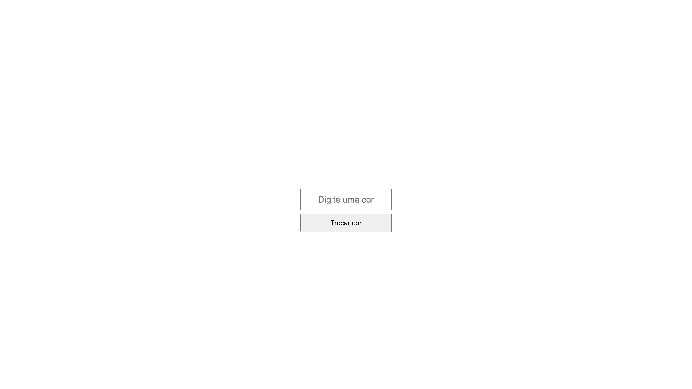

# pend-background-color-switcher
# 🎨 alternador de cores do fundo

Atividade FRONT-END brincando com javascript

---

## ℹ️ Sobre

Este repósitorio contém uma brincadeira, permite digitar a cor que desejamos para o fundo

---

## 🛠️ Tecnologias utilizadas

- **HTML**
- **CSS**
- **JAVASCRIPT**

---